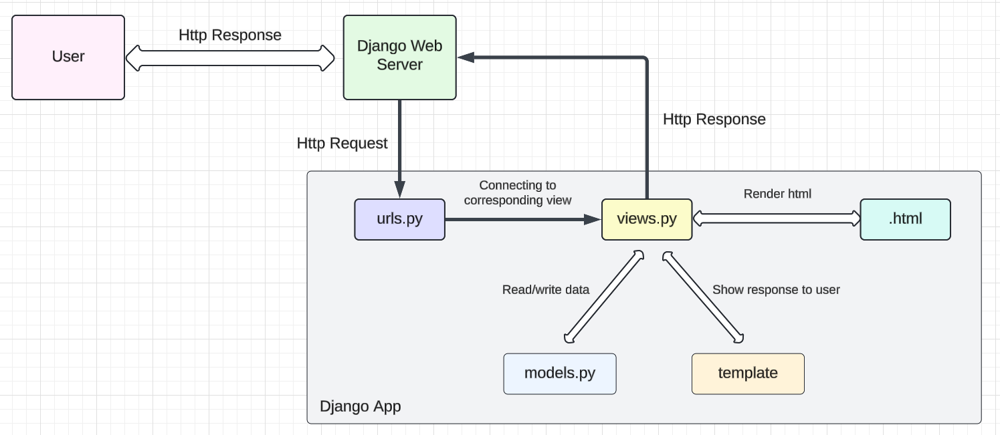

<!-- Nama : Wirya Dharma Kurnia
NPM: 2306152115
Kelas: PBP C -->

# Food Pedia

# Jawaban Soal Tugas 2

**Nama**: Wirya Dharma Kurnia  
**NPM**: 2306152115  
**Kelas**: PBP C

## 1. Jelaskan bagaimana cara kamu mengimplementasikan checklist di atas secara step-by-step (bukan hanya sekadar mengikuti tutorial).
Cara yang saya lakukan dalam tugas kali ini adalah sebagai berikut.
- Membuat repositori baru di github bernama “food-pedia” dengan visibility public.
- Membuat direktori lokal baru dengan nama “food-pedia” dan melakukan inisiasi git dengan perintah `git init`.
- Membuat branch utama dan menghubungkannya ke repositori GitHub.
- Membuat virtual environment dengan perintah `python -m venv env` dan mengaktifkannya dengan perintah `env\Scripts\activate`.
- Membuat file requirements.txt dan menginstall dependencies.
- Buat progek django dengan nama food_pedia menggunakan perintah `django-admin startproject food_pedia .`.
- Membuat app main dengan perintah `python manage.py startapp main`.
- Melakukan routing dengan konfigurasi URL pada app main.
- Melakukan konfigurasi pada `urls.py`.
- Membuat model dan menambahkan atribut wajib (name dengan tipe data CharField, price dengan tipe data IntegerField, dan description dengan tipe data TextField).
- Menambahkan atribut tambahan (quantity dengan tipe data IntegerField dan rating dengan tipe data FloatField).
- Menambahkan URL deployment PWS di bagian `ALLOWED_HOSTS` pada `settings.py`.
- Membuat migrasi model dengan perintah `python manage.py makemigrations`.
- Menerapkan migrasi ke dalam basis data lokal dengan perintah `python manage.py migrate`.
- Mengedit `main.html` untuk menyesuaikan layout informasi pada web.
- Mengatur function pada `views.py` sesuai tampilan yang diinginkan.
- Melakukan push perubahan ke GitHub dan PWS.

## 2. Buatlah bagan yang berisi request client ke web aplikasi berbasis Django beserta responnya dan jelaskan pada bagan tersebut kaitan antara urls.py, views.py, models.py, dan berkas html.

Request dari user akan diproses melalui Django Web Server ke urls.py terlebih dahulu. Kemudian, urls.py akan meneruskannya ke view yang sesuai. View lalu akan membaca/menulis data pada model, dan mengggunakan template untuk menunjkkan respon pada user. Berkas .html juga akan dirender sehingga views.py dapat mengembalikan respons yang diinginkan kembali kepada user.

## 3. Jelaskan fungsi git dalam pengembangan perangkat lunak!
Git merupakan sistem version control terdistribusi yang luas digunakan dalam pengembangan perangkat lunak. Git digunakan untuk membantu tim developer dalam bekerja, sehingga dapat bekerja secara kolaboratif dan memastikan setiap perubahan telah dicatat. Fungsinya antara lain adalah:
- Memonitor dan melacak setiap perubahan yang dibuat pada kode sumber
- Memungkinkan lebih dari satu developer untuk bekerja secara bersamaan pada proyek yang sama tanpa mengganggu pekerjaan satu sama lain
- Memungkinkan developer untuk membuat cabang baru dari kode utama dengan adanya branching, agar dapat mengerjakan fitur baru, memperbaiki bug, atau bereksperimen tanpa memengaruhi kode yang stabil.
- Menyediakan mekanisme backup untuk setiap proyek.
- Menyediakan fasilitas praktik code review sehingga developer lain dapat meninjau dan memberikan masukan sebelum kode digabungkan ke kode utama.

## 4. Menurut Anda, dari semua framework yang ada, mengapa framework Django dijadikan permulaan pembelajaran pengembangan perangkat lunak?
Menurut saya, framework Django dijadikan permulaan pembelajaran pengembangan perangkat lunak karena mudah digunakan dan memiliki fitur yang lengkap, misalnya ORM. Bahasa yang digunakan adalah Python, yaitu bahasa yang memang sudah dipelajari sebelumnya. Django juga memiliki struktur MVT (Model-View-Template), sehingga strukturnya mudah diapahami dan pelajar baru dapat memahami alur pengembangan web secara mendalam. Keamanan bawaan dari framework ini pun tergolong baik.

## 5. Mengapa model pada Django disebut sebagai ORM?
Model pada Django disebut sebagai ORM (Object Relational Mapping) karena menyediakan suatu lapisan abstraksi untuk interaksi dengan basis data  menggunakan Python, tanpa harus menulis query SQL secara langsung. ORM akan memetakan objek ke tabel dalam kelas Python, sehingga dapat memudahkan developer dalam melakukan operasi basis data seperti menambah, mengubah, ataupun menghapus data.
