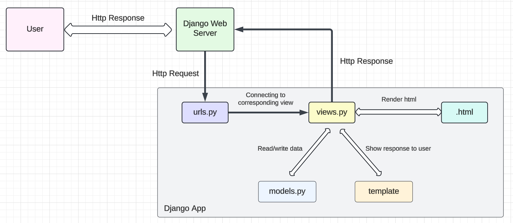
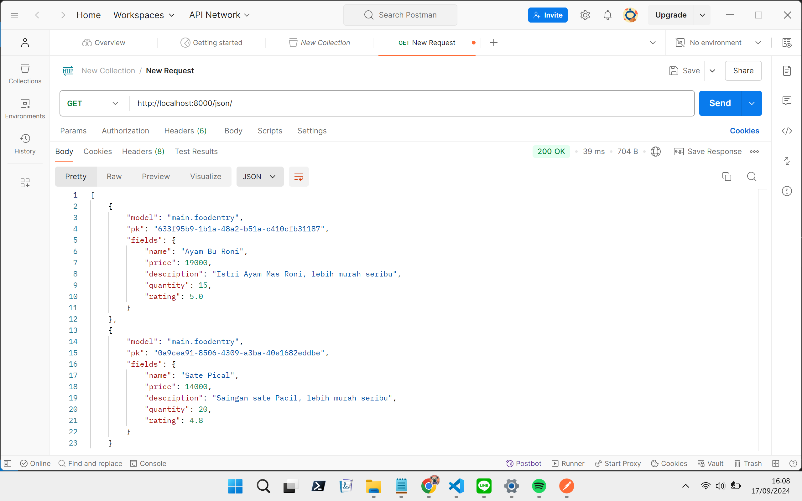
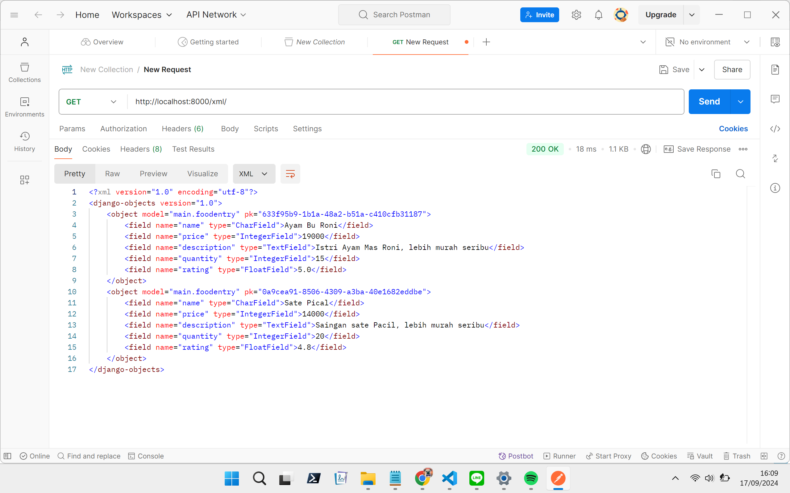
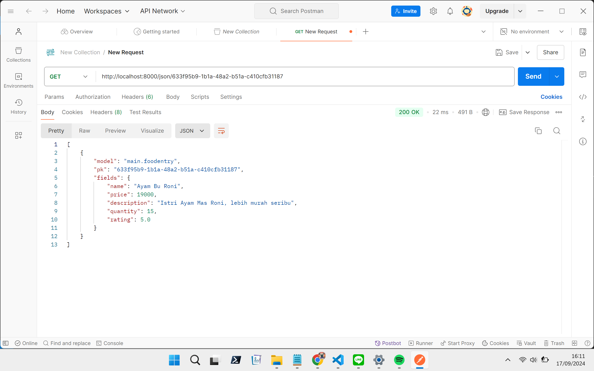
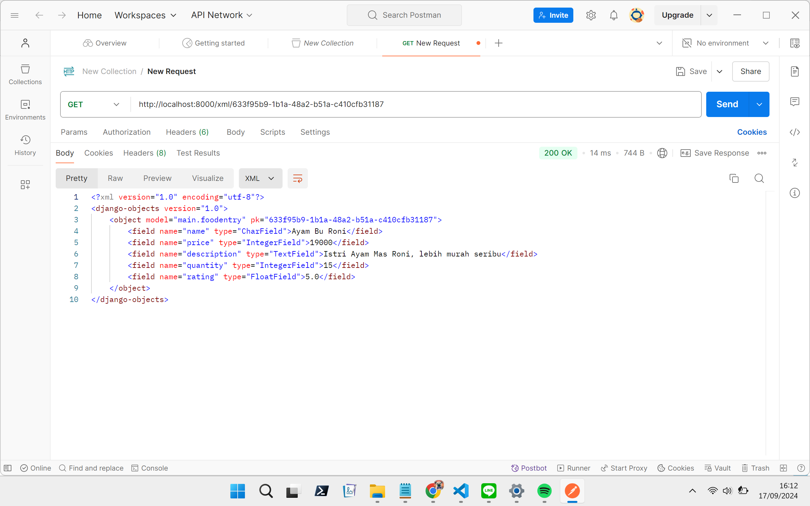

# Food Pedia

**Nama**: Wirya Dharma Kurnia <br />
**NPM**: 2306152115 <br />
**Kelas**: PBP C

**Link Web:** [http://wirya-dharma-foodpedia.pbp.cs.ui.ac.id/](http://wirya-dharma-foodpedia.pbp.cs.ui.ac.id/)

<details>
<summary><b>Tugas 2</b></summary>

# Jawaban Soal Tugas 2


## 1. Jelaskan bagaimana cara kamu mengimplementasikan checklist di atas secara step-by-step (bukan hanya sekadar mengikuti tutorial).
Cara yang saya lakukan dalam tugas kali ini adalah sebagai berikut.
- Membuat repositori baru di github bernama “food-pedia” dengan visibility public.
- Membuat direktori lokal baru dengan nama “food-pedia” dan melakukan inisiasi git dengan perintah `git init`.
- Membuat branch utama dan menghubungkannya ke repositori GitHub.
- Membuat virtual environment dengan perintah `python -m venv env` dan mengaktifkannya dengan perintah `env\Scripts\activate`.
- Membuat file requirements.txt dan menginstall dependencies.
- Buat progek django dengan nama food_pedia menggunakan perintah `django-admin startproject food_pedia .`.
- Membuat app main dengan perintah `python manage.py startapp main`.
- Melakukan routing dengan konfigurasi URL pada app main.
- Melakukan konfigurasi pada `urls.py`.
- Membuat model dan menambahkan atribut wajib (name dengan tipe data CharField, price dengan tipe data IntegerField, dan description dengan tipe data TextField).
- Menambahkan atribut tambahan (quantity dengan tipe data IntegerField dan rating dengan tipe data FloatField).
- Menambahkan URL deployment PWS di bagian `ALLOWED_HOSTS` pada `settings.py`.
- Membuat migrasi model dengan perintah `python manage.py makemigrations`.
- Menerapkan migrasi ke dalam basis data lokal dengan perintah `python manage.py migrate`.
- Mengedit `main.html` untuk menyesuaikan layout informasi pada web.
- Mengatur function pada `views.py` sesuai tampilan yang diinginkan.
- Melakukan push perubahan ke GitHub dan PWS.

## 2. Buatlah bagan yang berisi request client ke web aplikasi berbasis Django beserta responnya dan jelaskan pada bagan tersebut kaitan antara urls.py, views.py, models.py, dan berkas html.

Request dari user akan diproses melalui Django Web Server ke urls.py terlebih dahulu. Kemudian, urls.py akan meneruskannya ke view yang sesuai. View lalu akan membaca/menulis data pada model, dan mengggunakan template untuk menunjkkan respon pada user. Berkas .html juga akan dirender sehingga views.py dapat mengembalikan respons yang diinginkan kembali kepada user.

## 3. Jelaskan fungsi git dalam pengembangan perangkat lunak!
Git merupakan sistem version control terdistribusi yang luas digunakan dalam pengembangan perangkat lunak. Git digunakan untuk membantu tim developer dalam bekerja, sehingga dapat bekerja secara kolaboratif dan memastikan setiap perubahan telah dicatat. Fungsinya antara lain adalah:
- Memonitor dan melacak setiap perubahan yang dibuat pada kode sumber
- Memungkinkan lebih dari satu developer untuk bekerja secara bersamaan pada proyek yang sama tanpa mengganggu pekerjaan satu sama lain
- Memungkinkan developer untuk membuat cabang baru dari kode utama dengan adanya branching, agar dapat mengerjakan fitur baru, memperbaiki bug, atau bereksperimen tanpa memengaruhi kode yang stabil.
- Menyediakan mekanisme backup untuk setiap proyek.
- Menyediakan fasilitas praktik code review sehingga developer lain dapat meninjau dan memberikan masukan sebelum kode digabungkan ke kode utama.

## 4. Menurut Anda, dari semua framework yang ada, mengapa framework Django dijadikan permulaan pembelajaran pengembangan perangkat lunak?
Menurut saya, framework Django dijadikan permulaan pembelajaran pengembangan perangkat lunak karena mudah digunakan dan memiliki fitur yang lengkap, misalnya ORM. Bahasa yang digunakan adalah Python, yaitu bahasa yang memang sudah dipelajari sebelumnya. Django juga memiliki struktur MVT (Model-View-Template), sehingga strukturnya mudah diapahami dan pelajar baru dapat memahami alur pengembangan web secara mendalam. Keamanan bawaan dari framework ini pun tergolong baik.

## 5. Mengapa model pada Django disebut sebagai ORM?
Model pada Django disebut sebagai ORM (Object Relational Mapping) karena menyediakan suatu lapisan abstraksi untuk interaksi dengan basis data  menggunakan Python, tanpa harus menulis query SQL secara langsung. ORM akan memetakan objek ke tabel dalam kelas Python, sehingga dapat memudahkan developer dalam melakukan operasi basis data seperti menambah, mengubah, ataupun menghapus data.
</details>

<details>
<summary><b>Tugas 3</b></summary>

# Jawaban Soal Tugas 3


## 1. Jelaskan mengapa kita memerlukan data delivery dalam pengimplementasian sebuah platform!
Data delivery merupakan salah satu aspek terpenting dalam pengimplementasian sebuah platform. Alasannya adalah karena sebagai berikut.
- Akses data secara real-time:  Dalam platform digital, seringkali developer maupun pengguna membutuhkan data secara real-time, baik untuk pengembangan aplikasi maupun untuk kebutuhan konsumen. Misalnya dalam aplikasi e-commerce, konsumen harus dapat melihat stok barang yang tersisa sebelum memesan barang tersebut.
- Integrasi data antar komponen: Ada berbagai komponen dalam platform digital, di mana seluruh komponen tersebut memerlukan pertukaran data yang konsisten agar platform dapat berjalan dengan baik. Data delivery berperan untuk melakukan integrasi data secara efisien antar komponen-komponen tersebut sehingga pertukaran data dapat terjadi di lingkungan platform tersebut.
- Optimisasi performa platform: Data delivery sebagai aspek terpenting tentunya akan sangat memengaruhi performa suatu platform. Mengoptimalisasi data delivery tentunya akan meningkatkan kinerja platform secara keseluruhan, khususnya jika skala platform sudah berkembang luas dan memiliki banyak pengguna.
- Keamanan data: Dalam proses data delivery, seringkali data dilindungi dengan melibatkan protokol keamanan seperti enkripsi. Proses data delivery yang terstruktur tentunya akan mempermudah pengelolaan data secara aman, sehingga data yang bersifat rahasia dapat tetap terjaga kerahasiaan dan integritasnya.

## 2. Menurutmu, mana yang lebih baik antara XML dan JSON? Mengapa JSON lebih populer dibandingkan XML?
Menurut saya pribadi, di era platform digital yang bersifat modern ini JSON cenderung lebih baik jika dibandingkan dengan XML. Alasan yang mendukung pendapat saya adalah sebagai berikut.
- Kompleksitas yang rendah dan mudah dibaca: JSON memiliki struktur yang lebih sederhana dan ringkas dibandingkan XML. Hal ini dikarenakan JSON lebih berfokus pada pengiriman dan pertukaran data, sehingga lebih mudah digunakan untuk mengembangkan API, aplikasi, dan layanan web modern. JSON juga memiliki format penyajian data yang cenderung lebih mudah dibaca oleh manusia.
- Ukuran data yang lebih kecil: Ukuran data JSON lebih kecil dibandingkan XML, karena JSON tidak menggunakan banyak markup seperti XML dalam membungkus data. Hal ini menyebabkan penyimpanan yang digunakan menjadi lebih sedikit sehingga program dapat berjalan dengan lebih cepat dan efisien.
- Kecepatan pemrosesan data: Karena ukurannya lebih kecil, pemrosesan data dengan JSON juga mengalami peningkatan jika dibandingkan dengan XML. Karena itu, JSON lebih cocok digunakan untuk program yang membutuhkan respon yang cepat dengan pertukaran data yang sederhana.
Karena alasan-alasan di atas, JSON lebih populer dibandingkan XML untuk kebanyakan aplikasi modern saat ini.

## 3. Jelaskan fungsi dari method `is_valid()` pada form Django dan mengapa kita membutuhkan method tersebut?
Method `is_valid()` pada form Django berfungsi untuk melakukan validasi terhadap data yang masuk ke dalam form. Hal ini penting untuk memastikan semua data yang masuk ke dalam form telah memenuhi aturan validasi yang ditentukan. Alasan method ini penting dan dibutuhkan adalah sebagai berikut.
- Validasi data: Ini merupakan tujuan utama dari method `is_valid()`, yaitu memastikan bahwa semua field data yang dibutuhkan telah terisi sesuai dengan tipe data yang diminta, dan memenuhi aturan validasi yang berlaku (seperti nilai minimum dari integer atau panjang minimum dari string).
- Feedback kepada user: Django dapat memberikan pesan error tertentu kepada user jika data yang dimasukkan tidak sesuai. Hal ini memudahkan user untuk memperbaiki input yang dimasukkan.
- Meningkatkan keamanan: Validasi data menyebabkan input yang diterima oleh program cenderung aman. Dalam beberapa kasus, ada kemungkinan input yang dimasukkan berbahaya dan dapat memicu serangan seperti injection. Hal ini dicegah dengan validasi data yang dilakukan method `is_valid()`.

## 4. Mengapa kita membutuhkan `csrf_token` saat membuat form di Django? Apa yang dapat terjadi jika kita tidak menambahkan `csrf_token` pada form Django? Bagaimana hal tersebut dapat dimanfaatkan oleh penyerang?
`csrf_token` pada Django berfungsi sebagai salah satu mekanisme perlindungan untuk keamanan platform, khususnya dalam perlindungan serangan Cross-Site Request Forgery (CSRF). CSRF merupakan serangan di mana penyerang melakukan eksploitsi kredensial pengguna lain untuk membuat mereka mengirim request yang tidak sah ke situs web tertentu tanpa sepengetahuan atau izin pengguna tersebut. Dalam hal ini, `csrf_token` berguna untuk memverifikasi request yang dikirim berasal dari pengguna yang sah.

Jika kita tidak menambahkan `csrf_token` pada form Django, aplikasi akan rentan terhadap serangan CSRF. Ini memberikan kesempatan kepada penyerang untuk melakukan aksi dengan memanfaatkan kredensial pengguna lain. Hal tersebut dimanfaatkan penyerang dengan cara sebagai berikut.
- Penyerang bisa saja membuat request HTTP palsu dengan formulir HTML atau script JavaScript, yang secara otomatis mengirim reuqest yang tidak diinginkan.
- Ketika pengguna yang sah mengunjungi halaman penyerang dalam sesi aplikasi yang sedang berlangsung, browser dapat menyertakan cookie sesi yang valid sehingga server akan menganggap request tersebut bersifat sah.
- Jika hal ini terjadi, penyerang dapat memanfaatkannya untuk melakukan tindakan kriminal seperti pencurian data, transaksi yang tidak sah, dan masih banyak lagi.

## 5. Jelaskan bagaimana cara kamu mengimplementasikan checklist di atas secara step-by-step (bukan hanya sekadar mengikuti tutorial).
Cara yang saya lakukan dalam tugas kali ini adalah sebagai berikut.
- Membuat direktori `templates` pada root folder dan mengisinya dengan `base.html`, yang berfungsi sebagai template dasar/kerangka views dari web.
- Menambahkan `templates` yang telah dibuat pada `settings.py`.
- Mengubah `main.html` pada subdirektori `main/templates` dengan menggunakan `base.html` sebagai template utama.
- Menghapus berkas `db.sqlite3` untuk mengosongkan objek pada model. Kemudian melakukan `import uuid` pada `models.py` dan dilanjutkan dengan melakukan migrasi perubahan tersebut.
- Membuat berkas `forms.py` pada direktori `main` dan mengisinya sesuai model yang telah dibuat sebelumnya. 
- Menambahkan import redirect pada `views.py` di direktori `main`, lalu membuat fungsi `create_food_entry` yang menerima parameter request. Fungsi ini melakukan redirect ke fungsi `show_main`.
- Mengubah fungsi `show_main` sesuai kebutuhan web. Dalam web saya, fungsi ini mengambil data entri makanan yang sudah default dan yang dari database, kemudian menampilkannya pada halaman web. Context pada fungsi ini akan berubah sehingga berupa gabungan entri default dan database.
- Menambahkan import `create_mood_entry` dan path fungsi ke berkas `urls.py`.
- Membuat berkas HTML baru dengan nama `create_food_entry.html` pada direktori `main/templates` dan mengubah isinya sesuai kebutuhan web Food Pedia. Berkas ini berfungsi untuk menandakan block dengan metode POST, meningkatkan security terhadap serangan CSRF, menampilkan fields `forms.py` sebagai table, dan mengirim request ke view `create_food_entry(request)` dengan tombol submit.
- Mengedit `main.html` untuk menambahkan tombol "Add New Food".
- Pada berkas `views.py`, lakukan import `HttpResponse`, `Serializer`, dan membuat 4 fungsi baru untuk menampilkan data pada JSON dan XML. Fungsi tersebut adalah `show_xml`, `show_json`, `show_xml_by_id`, dan `show_json_by_id`.
- Menambahkan fungsi baru yaitu `delete_item` yang menerima parameter request dan pk, yang berfungsi untuk menghapus data tertentu pada database. Path kelima fungsi baru ini juga ditambahkan pada bagian `urlpatterns` di berkas `urls.py`.
- Membuat berkas `deploy.yml` pada direktori `.github/workflows/` agar dapat melakukan push ke GitHub sekaligus PWS.
- Melakukan push perubahan ke GitHub, yang secara otomatis akan meneruskannya ke PWS dengan GitHub actions.

## Dokumentasi URL Postman
`show_json`: 
`show_xml`: 
`show_json_by_id`: 
`show_xml_by_id`: 
</details>

<details>
<summary><b>Tugas 4</b></summary>

# Jawaban Soal Tugas 4


## 1. Apa perbedaan antara `HttpResponseRedirect()` dan `redirect()`?
Pada umumnya, `HttpResponseRedirect()` dan `redirect()` sama-sama bisa digunakan untuk melakukan pengalihan (redirect) ke URL lain. Namun, ada beberapa perbedaan dari keduanya yaitu sebagai berikut.
- `HttpResponseRedirect()` merupakan kelas bawaan Django yang hanya dapat digunakan untuk melakukan redirect ke suatu URL tertentu, sehingga argumen yang diberikan hanya sebatas berupa URL saja. Cara kerjanya adalah dengan mengembalikan objek `HttpResponseRedirect()` dari view yang ingin ditampilkan.
- `redirect()` bersifat lebih fleksibel dan umum, karena dapat melakukan redirect tidak hanya menggunakan URL, namun juga bisa menggunakan nama view dan objek model. Maka dari itu, `redirect()` dapat menerima lebih banyak argumen dibandingkan `HttpResponseRedirect()`.

## 2. Jelaskan cara kerja penghubungan model `Product` dengan `User`!
Cara kerja penghubungan model `Product` dengan `User` terbagi menjadi 3 jenis hubungan, yaitu sebagai berikut.

PS: Untuk contoh di bawah, anggaplah kita sudah melakukan import models dan User dengan cara:
```python
from django.db import models
from django.contrib.auth.models import User
```

* Many-to-many relationships

Konsep hubungan ini adalah satu `Product` dapat dimiliki oleh banyak `User`, dan satu `User` juga dapat memiliki banyak `Product`. Analogi yang mungkin mudah dipahami adalah makanan sebagai `Product` dan restoran sebagai `User`. Satu makanan bisa dimiliki banyak restoran, dan satu restoran juga bisa memiliki banyak makanan. Untuk mengimplementasikan hubungan ini, kita dapat menggunakan `ManyToManyField()`.
Contoh:

```python
class Product(models.Model):
    name = models.CharField()
    owner = models.ManyToManyField(User)
```

* Many-to-one relationships

Konsep hubungan ini adalah satu `Product` hanya dapat dimiliki oleh satu `User`, namun satu `User` dapat memiliki banyak `Product`. Analogi yang mungkin mudah dipahami adalah mainan sebagai `Product` dan anak sebagai `User`. Satu mainan hanya bisa dimiliki oleh satu anak, namun satu anak dapat memiliki banyak mainan. Untuk mengimplementasikan hubungan ini, kita dapat menggunakan `ForeignKey()`.
Contoh:

```python
class Product(models.Model):
    name = models.CharField()
    owner = models.ForeignKey(User, on_delete=models.CASCADE)
```

Dalam contoh ini, `on_delete=models.CASCADE` akan menyebabkan penghapusan semua produk jika user yang memiliki model tersebut dihapus. Ini adalah jenis hubungan yang digunakan dalam tugas e-commerce Food Pedia kali ini.

* One-to-one relationships

Konsep hubungan ini adalah satu `Product` hanya dapat dimiliki oleh satu `User`, dan satu `User` juga hanya dapat memiliki satu `Product`. Analogi yang mungkin mudah dipahami adalah KTP sebagai `Product` dan seorang warga negara sebagai `User`. Satu KTP hanya bisa dimiliki oleh satu warga negara, dan satu warga negara juga hanya dapat memiliki satu KTP. Untuk mengimplementasikan hubungan ini, kita dapat menggunakan `OneToOneField()`.
Contoh:

```python
class Product(models.Model):
    name = models.CharField()
    owner = models.OneToOneField(User, on_delete=models.CASCADE)
```

## 3. Apa perbedaan antara authentication dan authorization, apakah yang dilakukan saat pengguna login? Jelaskan bagaimana Django mengimplementasikan kedua konsep tersebut.
- Authentication

Merupakan proses memverifikasi identitas user. Langkah ini berfungsi untuk memastikan bahwa user yang sedang login benar merupakan user yang sah.
Saat pengguna login, sistem akan memeriksa kredensial yang dimasukkan user misalnya seperti username dan password, lalu mencocokannya dengan informasi yang ada di database. Jika informasi dari user dan informasi dari database cocok, maka user akan mendapat izin untuk mengakses sistem.
- Authorization

Merupakan proses memverifikasi apakah user memiliki akses untuk mengakses sesuatu. Dengan kata lain, proses ini mengontrol akses user terhadap sumber daya yang ada pada sistem. Proses authorization baru akan dijalankan setelah user berhasil login.
Setelah user berhasil login, akan dilakukan pemeriksaan otorisasi untuk setiap request user ketika mereka ingin mengakses bagian dari sistem yang memerlukan hak akses khusus.

Django mengimplementasikan kedua konsep tersebut dengan alur sebagai berikut.
- User akan mengakses URL melalui browser dan mengirimkan request ke internet. Request ini akan diteruskan ke web server.
- Sebelum user diperbolehkan masuk ke server, Django akan melakukan authentication dan authorization pada session user. Authentication akan mengecek apakah user tersebut adalah user yang sah, dan authentication akan menentukan apakah user memiliki izin untuk mengakses sistem yang ada.
- Jika kedua proses tersebut berhasil, maka Django akan meneruskan request ke web server. Di sini, argumen akan diekstrak melalui request sehingga dapat mengakses `views.py`. File ini berisi kode Python untuk menangani logika untuk menghasilkan respons web.
- Setelah diproses di dalam `views.py`, value dari proses tersebut digabungkan dengan template HTML, CSS, dan JavaScript untuk membentuk halaman web yang akan dikirim kembali kepada user.
- Halaman web yang dihasilkan akan dikirim kembali ke user melalui internet, sehingga user dapat melihat halaman web yang diinginkan melalui browser mereka.

Dari kode pada tugas ini, kedua proses ini dapat diamati kerjanya melalui `views.py`. Contoh proses authentication adalah method `login_user`, dimana user akan diminta untuk memasukkan kredensial (username dan password) dan jika kredensialnya valid (cocok dengan informasi di database), user akan dianggap terautentikasi dan status login akan disimpan di session. Sedangkan contoh proses authorization adalah bagian `@login_required(login_url='/login')` di atas method yang ada. Artinya, method yang bersangkutan baru dapat digunakan oleh user yang telah berhasil login. Karena dalam tugas kali ini belum ada akses khusus untuk user tertentu, maka asal user berhasil login artinya ia dapat menggunakan semua method yang tersedia.

## 4. Bagaimana Django mengingat pengguna yang telah login? Jelaskan kegunaan lain dari cookies dan apakah semua cookies aman digunakan?
Dalam mengingat user yang telah login, Django menggunakan session framework yang berfungsi membuat sesi baru dan menyimpan informasi user di dalam server (database atau memori). Setelah itu, sebuah cookie dengan ID sesi user akan dikirim ke browser user. Dengan cara ini, setiap kali user mengirim request ke server maka Django dapat mengidentifikasi sesi user dan memuat informasi yang dibutuhkan.

Selain menyimpan infromasi login user, kegunaan lain dari cookies adalah sebagai berikut.
- Menyimpan preferensi user: Cookies dapat membantu menyimpan informasi mengenai preferensi user misalnya seperti mode warna web atau bahasa yang digunakan. Dengan begitu, user tidak perlu mengatur hal seperti ini lagi setiap kali mereka menggunakan web tersebut.
- Personalisasi user: Cookies dapat membantu web untuk menyesuaikan jenis konten yang disajikan kepada user berdasarkan perilaku dan preferensi user selama menggunakan web. Dengan begitu, user akan disajikan dengan konten yang sering dilihat atau direkomendasikan fitur tertentu yang sering ia gunakan.
- Tracking digital: Selain untuk personalisasi, cookies juga dapat digunakan untuk menganalisis aktivitas user sehingga dapat berguna dalam analisis dan pemasaran. Informasi ini dapat digunakan dalam bisnis, misalnya untuk menampilkan iklan sesuai dengan aktivitas user selama menggunakan web.
- Khusus untuk bisnis e-commerce, cookies dapat membantu untuk personalisasi pengalaman user. Hal ini diimplementasikan dalam berbagai hal, misalnya fitur keranjang belanja, menyimpan alamat yang sering digunakan user, jenis layanan yang menjadi preferensi user, dan masih banyak lagi.

Apakah semua cookies aman digunakan?

Pada umumnya, cookies aman digunakan karena tidak  menyimpan informasi sensitif atau kode berbahaya. Cookies juga tidak dapat melakukan tindakan sendiri tanpa persetujuan user yang bersangkutan. Meski demikian, ada beberapa hal yang harus diperhatikan dalam penggunaan cookies.
- Cookies dapat berupa cookies sesi (berlaku untuk sesi login user saat ini, dan akan dihapus ketika user logout) dan cookies permanen (disimpan di perangkat user). Cookies permanen bersifat lebih rentan terhadap serangan jika tidak dikelola dengan aman.
- Karena merupakan file teks biasa, cookies berpotensi diambil oleh aplikasi lain jika jaringan yang digunakan tidak aman.
- Hindari cookies yang menyimpan informasi sensitif. Jika memang menggunakannya, gunakanlah HTTPS (Hypertext Transfer Protocol Secure, yang merupakan versi lebih aman dari HTTP) untuk melakukan enkripsi data.

## 5. Jelaskan bagaimana cara kamu mengimplementasikan checklist di atas secara step-by-step (bukan hanya sekadar mengikuti tutorial).
Cara yang saya lakukan dalam tugas kali ini adalah sebagai berikut.
- Melakukan import `UserCreationForm` dan `messages`, serta menambahkan fungsi `register` pada `views.py`.
- Membuat `register.html` di `main/templates` sebagai template tampilan halaman register.
- Melakukan import fungsi `register` dan menambahkan pathnya di `urls.py` direktori `main`.
- Melakukan import `authenticate`, `login`, dan `AuthenticationForm`, serta menambahkan fungsi `login_user` pada `views.py`. Semua ini berfungsi untuk melakukan autentikasi dan jika berhasil akan melakukan login.
- Membuat `login.html` di `main/templates/` sebagai template tampilan halaman login.
- Melakukan import fungsi `login_user` dan menambahkan pathnya di `urls.py` direktori `main`.
- Membuat fitur logout dengan cara yang sama persis dengan pembuatan fitur login. Hanya saja, tampilannya diimplementasikan langsung di main.html karena hanya memerlukan tombol logout saja (tidak memerlukan halaman khusus).
- Menggunakan data dari cookies, yaitu awalnya dengan import `HttpResponseRedirect`, `reverse`, dan `datetime` pada `views.py`.
- Menambahkan fungsionalitas cookie untuk melihat waktu terakhir login pengguna pada fungsi `login_user`. Setelah perubahan, cookie last_login user akan ditambahkan ke dalam response yang diberikan server.
- Menambahkan `'last_login': request.COOKIES['last_login']` ke `context` pada fungsi `show_main`.
- Mengubah fungsi `logout_user` sehingga cookie `last_login` dihapus saat user logout.
- Menambahkan informasi data sesi terakhir login pada `main.html`.
- Menghubungkan model dengan user, yaitu pertama dengan melakukan import model pada `models.py` di `main`.
- Selanjutnya, hubungkan model dengan satu user melalui sebuah relationship.
- Mengubah fungsi `create_food_entry` pada `views.py` untuk memungkinkan modifikasi objek sebelum disimpan di database.
- Mengubah value dari `food_entries` dan `context` pada fungsi `show_main`. Hal ini dilakukan agar program dapat menampilkan objek Food Entry dari user yang sedang login saja.
- Melakukan migrasi model untuk mengimplementasikan perubahan.
</details>

<details>
<summary><b>Tugas 5</b></summary>

# Jawaban Soal Tugas 5


## 1. Jika terdapat beberapa CSS selector untuk suatu elemen HTML, jelaskan urutan prioritas pengambilan CSS selector tersebut!
- Inline style
Gaya yang diterapkan langsung pada elemen HTML menggunakan atribut *style* . Karena gaya ini langsung ditulis pada elemen, maka akan ditempatkan di urutan paling atas sehingga menimpa gaya lain yang diterapkan pada elemen HTML.
Contoh:
```html
<div style="color: red;">Text</div>
```
- ID Selector
Selector yang menggunakan ID yang bersifat unik.
Contoh:
```css
#myElement {
    color: blue;
}
```
- Classes, Attributes, dan Pseudo-Classes
Selector yang menggunakan kelas, atribut, dan pseudo-class.
Contoh:
```css
.myClass {
    color: green;
}
[type="text"] {
    color: yellow;
}
```
- Element (Tag) dan Pseudo-Elements
Selector yang menggunakan tag HTML dan pseudo-element.
Contoh:
```css
div {
    color: black;
}
```
- Universal Selector
Selector universal yang berlaku untuk semua elemen.
Contoh:
```css
* {
    color: gray;
}
```

## 2. Mengapa *responsive design* menjadi konsep yang penting dalam pengembangan aplikasi *web*? Berikan contoh aplikasi yang sudah dan belum menerapkan *responsive design*!
*Responsive design* menjadi konsep yang penting dalam pengembangan aplikasi *web* karena memiliki fungsi penting yaitu untuk meningkatkan pengalaman pengguna, memperbaiki SEO (*Search Engine Optimization*), serta membuat proses pengembangan menjadi lebih efisien. Hal ini menjadi penting di era modern ini karena pengguna cenderung mengakses aplikasi *web* dari berbagai perangkat dengan ukuran layar yang berbeda, seperti ponsel, tablet, laptop, dan desktop.
Contoh aplikasi yang sudah menerapkan *responsive design* adalah YouTube dan Spotify. Kedua aplikasi tersebut telah menyesuaikan antarmuka mereka secara dinamis sesuai perangkat yang digunakan oleh pengguna. Sementara itu, contoh aplikasi yang belum menerapkan *responsive design* adalah SIAKNG. Aplikasi ini belum menerapkan *responsive design* secara penuh sehingga pengalaman pengguna cenderung kurang optimal ketika mengaksesnya dari berbagai perangkat dengan ukuran layar yang berbeda.

## 3. Jelaskan perbedaan antara *margin*, *border*, dan *padding*, serta cara untuk mengimplementasikan ketiga hal tersebut!
Secara umum *margin*, *border*, dan *padding* merupakan tiga elemen penting dalam box model CSS yang digunakan untuk mengontrol ruang di sekitar elemen HTML. 
- *Margin*
Ruang kosong di luar border elemen, yang memisahkan elemen dari elemen lain di sekitarnya. 
Contoh:
```css
div {
    margin: 20px;
}
```
- *Border*
Garis terlihat yang mengelilingi elemen dan dapat disesuaikan ketebalan, jenis, dan warnanya; serta terletak di antara *margin* dan *padding*.
Contoh:
```css
div {
    border: 2px solid black;
}
```
- *Padding*
Ruang kosong di dalam elemen di antara elemen dan border, sehingga elemen tidak langsung menempel pada border.
Contoh:
```css
div {
    padding: 15px;
}
```
Ketiganya juga dapat diimplementasikan bersamaan menggunakan properti CSS, seperti contoh sebagai berikut.
```css
.element {
    margin: 20px;           /* Ruang di luar border */
    border: 2px solid blue; /* Border berwarna biru setebal 2px */
    padding: 15px;          /* Ruang di dalam border */
}
```

## 4. Jelaskan konsep *flexbox* dan *grid layout* beserta kegunaannya!
*Flexbox* dan *Grid Layout* merupakan dua teknik tata letak pada CSS yang fungsinya untuk merancang dan mengatur tata letak elemen pada halaman web dengan fleksibel dan efisien. Keduanya memiliki peran yang penting dalam pembuatan desain web responsif.
- *Flexbox* adalah model tata letak yang dirancang untuk satu dimensi (baik baris atau kolom) yang memungkinkan distribusi ruang antar elemen di dalam *container* secara fleksibel dan merata, meski jika ukuran elemen-elemen tersebut tidak tetap. *Flexbox* sangat membantu dalam membuat navigasi, menu, atau elemen yang membutuhkan penyesuaian responsif dalam satu arah.
- Grid Layout adalah model tata letak dua dimensi (baris dan kolom) yang lebih kompleks karena dapat membuat tata letak yang lebih detail dengan membagi halaman web menjadi *grid* (kotak-kotak) dan menempatkan elemen di posisi tertentu. *Grid Layout* memungkinkan kontrol penuh atas tata letak dalam dua arah sekaligus, baik horizontal maupun vertikal. Tata letak ini cocok digunakan untuk desain kompleks seperti *dashboard*, *layout* halaman utama, dan lain-lain.

## 5. Jelaskan bagaimana cara kamu mengimplementasikan checklist di atas secara step-by-step (bukan hanya sekadar mengikuti tutorial)!
Cara yang saya lakukan dalam tugas kali ini adalah sebagai berikut.
- Menambahkan fungsi baru pada `views.py` yaitu `edit_food` yang berfungsi untuk mengedit data produk dan `delete_food` yang berfungsi untuk menghapus produk yang sudah ada.
- Melakukan import dan menambahkan path dua fungsi baru tersebut di `urls.py`.
- Membuat folder `static` yang di dalamnya terdapat folder `css` sebagai tempat penyimpanan `global.css` yang berfungsi untuk mendefinisikan gaya yang berlaku secara global di aplikasi web, dan `image` sebagai tempat penyimpanan gambar yang digunakan dalam aplikasi web.
- Melakukan *adjustment* pada `settings.py` agar dapat menggunakan static files yang ada.
- Mengubah `base.html` karena aplikasi web kali ini akan menggunakan Tailwind.
- Membuat `navbar.html` yang berfungsi sebagai file untuk mengatur *navigation bar* pada aplikasi web.
- Membuat design dari *navigation bar* sesuai selera.
- Membuat beberapa file lain seperti `card_food.html`, `card_info.html`, `edit_food.html`, `login_html`, dan `register_html` untuk melengkapi fungsionalitas aplikasi web. Tampilan masing-masing halaman juga disesuaikan sesuai fungsi dan selera.
- Mengubah `main.html` untuk menampilkan produk yang ada dengan menggunakan tampilan `card_food.html`.
- Melengkapi tampilan *card* setiap produk dengan tombol edit dan hapus produk.
- Melakukan add, commit, dan push semua perubahan ke GitHub dan PWS.
</details>

<details>
<summary><b>Tugas 6</b></summary>

# Jawaban Soal Tugas 6


## 1.  Jelaskan manfaat dari penggunaan JavaScript dalam pengembangan aplikasi web!
Penggunaan JavaScript dalam pengembangan aplikasi web yang utama adalah menjadikan aplikasi web bersifat lebih dinamis. Dengan JavaScript, browser dapat merespons aksi pengguna, mengubah tata letak konten pada halaman, hingga memberi pembaruan real-time jika diperlukan tanpa memuat ulang keseluruhan halaman. Beberapa manfaat dari penggunaan JavaScript dalam pengembangan aplikasi web adalah sebagai berikut.
- **Interaksi yang lebih dinamis**

JavaScript memungkinkan browser menjadi lebih interaktif dengan pengguna sehingga meningkatkan pengalaman mereka dalam menggunakan aplikasi web.
- **Meningkatkan responsivitas**

JavaScript dapat mengeksekusi kode di sisi klien, sehingga mengurangi beban server dan responsivitas aplikasi web dapat meningkat karena data diproses secara lokal.
- **Integrasi dengan API**

JavaScript mendukung integrasi dengan API eksternal, sehingga lebih mudah untuk mengambil data dari sumber lain dan menampilkannya pada web secara dinamis.
- **Ketersediaan *framework* dan *library***

JavaScript memiliki banyak *framework* dan *library* yang mampu meningkatkan efisiensi waktu dan tenaga dalam pengembangan aplikasi web
- **Kemampuan lintas platform dan pengembangan mobile**

Saat ini, JavaScript telah didukung penggunaannya oleh banyak browser modern. Hal ini menyebabkan aplikasi web akan mudah diakses melalui berbagai perangkat dan sistem operasi. JavaScript juga memungkinkan penggunaan satu bahasa untuk berbagai platform.

## 2. Jelaskan fungsi dari penggunaan `await` ketika kita menggunakan `fetch()`! Apa yang akan terjadi jika kita tidak menggunakan `await`?
Dalam mengembangkan aplikasi web khususnya dengan JavaScript, penggunaan `await` ketika menggunakan `fetch()` memegang peran penting untuk menangani operasi asinkronus secara mudah dan intuitif. Ketika melakukan HTTP request dengan `fetch()`, operasi membutuhkan waktu untuk eksekusi kode terutama jika membutuhkan data dari server. Karena operasi ini bersifat asinkronus, maka ia akan mengembalikan *promise* yang artinya proses akan berlanjut ke kode berikutnya tanpa menunggu respon server. 

Penggunaan `await` dalam hal ini berguna untuk menunggu hingga `fetch()` selesai, sehingga JavaScript akan menghentikan proses pada baris kode yang bersangkutan dan menunggu *promise* dari `fetch()`.

Jika kita tidak menggunakan `await`, maka kode berikutnya akan dieksekusi sebelum *promise* dari `fetch()` selesai dikembalikan. Akibatnya, kita harus menggunakan `.then()` agar *promise* dari `fetch()` selesai sebelum mengakses data yang dikembalikan dari server. Pendekatan ini membuat kode lebih sulit dibaca khususnya jika banyak operasi asinkronus yang perlu dikelola. Selain itu, kode juga lebih sulit dipelihara terutama jika menangani skenario yang kompleks. Jika kode mencoba mengakses data yang belum tersedia dari respon server, maka dapat mengakibatkan kesalahan data atau bahkan error selama proses eksekusi kode.

Intinya, `await` membuat kode lebih mudah dibaca dan dikelola karena menunggu hingga *promise* yang asinkronus dari `fetch()` selesai sebelum mengeksekusi kode selanjutnya. Tanpa `await`, kode tidak akan menunggu sehingga harus menggunakan `.then()` yang cenderung kurang efisien untuk mengelola respon. Jika proses menunggu ini tidak dilakukan sama sekali baik dengan `await` maupun `.then()`, maka dapat menyebabkan kesalahan data atau error dalam eksekusi kode.

## 3. Mengapa kita perlu menggunakan *decorator* `csrf_exempt` pada view yang akan digunakan untuk AJAX `POST`?
Pada umumnya, Django telah menerapkan perlindungan Cross-Site Request Forgery (CSRF) secara *by default* kepada view yang menerima POST request. Dengan adanya perlindungan ini, setiap POST request harus menyertakan token CSRF yang valid yang disertakan melalui form HTML dengan tag . 

Meski dilakukan demi keamanan, menyertakan token CSRF ini dapat menjadi tantangan khususnya dalam konteks AJAX POST request yang berasal dari domain berbeda atau aplikasi *single-page*. Hal tersebut terjadi karena AJAX POST request seringkali bersifat dinamis tanpa melakukan *refresh* halaman secara langsung, sehingga menyebabkan tidak adanya akses ke token CSRF yang di-*generate* oleh server.

Dalam hal ini, *decorator* `@csrf_exempt` berfungsi untuk menonaktifkan perlindungan CSRF pada view tertentu, sehingga memungkinkan permintaan POST tanpa menyertakan token CSRF.

Menonaktifkan perlindungan CSRF pada suatu view tentunya membuka celah dalam hal keamanan aplikasi web. Maka dari itu, penggunaan *decorator* `@csrf_exempt` sebaiknya dilakukan dengan bijak dan hanya ketika dibutuhkan saja. Penggunaannya pun sebaiknya diimbangi dengan mekanisme keamanan tambahan untuk meminimalisir adanya serangan CSRF terhadap aplikasi web.

## 4. Pada tutorial PBP minggu ini, pembersihan data *input* pengguna dilakukan di belakang (*backend*) juga. Mengapa hal tersebut tidak dilakukan di *frontend* saja?
Pembersihan data *input* pengguna di bagian *frontend* merupakan langkah awal untuk memberi umpan balik secara cepat kepada pengguna. Hal ini biasanya digunakan untuk meminimalisir input yang tidak sesuai sebelum data tersebut dicek di database. Contohnya adalah ketika meminta input nomor telepon, *frontend* dapat langsung mengembalikan respon input tidak valid kepada pengguna jika field nomor telepon diisi dengan karakter yang bukan angka.

Pada tutorial PBP minggu ini, pembersihan data *input* pengguna dilakukan di belakang (*backend*) juga karena beberapa alasan, yaitu sebagai berikut.
- Memperkuat keamanan

Input pada sisi *frontend* cenderung mudah dimanipulasi oleh pengguna misalnya dengan menonaktifkan JavaScript pada browsernya, memodifikasi kode HTML, atau menggunakan alat seperti *Postman* untuk mengirim data secara langsung ke server tanpa melalui aplikasi web. Karena itu, sisi *backend* juga harus melakukan pembersihan data *input* untuk melindungi aplikasi dari input yang berbahaya.

- Logika validasi yang lebih kompleks

Terkadang ada beberapa logika validasi yang cukupm rumit bila dilakukan pada sisi *frontend*. Biasanya logika validasi ini memerlukan akses ke database, contohnya untuk mengecek apakah username yang dimasukkan sudah digunakan orang lain atau belum. Selain itu, *backend* juga dapat memasukkan validasi tambahan tertentu berdasarkan aturan bisnis atau aturan kredensial lainnya.

- Penguraan beban sisi *frontend*

Jika validasi yang kompleks dilakukan pada sisi *frontend*, biasanya pembersihan dilakukan secara kurang mendalam. Selain itu, pembersihan pada *frontend* dilakukan dengan tujuan mewujudkan *user experience* yang lebih baik, seperti memberi tahu jika format input salah. Jika pembersihan terlalu kompleks, *user experience* bisa menjadi kurang baik karena kompleksitas yang cenderung tinggi.

Pada akhirnya, tentu akan lebih baik untuk menggunakan kombinasi pembersihan input dari *frontend* dan *backend* agar dapat mengembangkan aplikasi web secara aman dan efisien. Pembersihan pada sisi *frontend* berfungsi sebagai langkah awal untuk memberi umpan balik secara cepat kepada pengguna untuk validasi sederhana, dan pembersihan pada sisi *backend* berfungsi untuk menjaga keamanan data dan validasi yang lebih jauh.

## 5. Jelaskan bagaimana cara kamu mengimplementasikan *checklist* di atas secara *step-by-step* (bukan hanya sekadar mengikuti tutorial)!
Cara yang saya lakukan dalam tugas kali ini adalah sebagai berikut.
- Menambahkan *error message* pada `login_user` di `views.py` dan *redirect* kembali ke halaman login. Ini berfungsi memberi tahu user bahwa *username* atau *password* yang dimasukkan salah dan meminta input kembali.
- Membuat fungsi `add_food_entry_ajax` di `views.py` untuk menambahkan entri makanan dengan ajax. 
- Menambahkan validasi form agar dapat menangkap jika ada input yang tidak sesuai, khususnya serangan XSS.
- Menambahkan *routing* untuk fungsi `add_food_entry_ajax` pada `urls.py`.
- Mengganti proses menampilkan data *food entry* dengan mendapatkan objek *food entry* dari *endpoint* `/json`.
- Menambahkan *block conditional* pada `main.html` untuk mengatasi kondisi jika belum ada entri makanan.
- Menambahkan *block* `<script>` dan membuat fungsi `getFoodEntries` untuk mendapatkan entri  makanan, serta fungsi `refreshFoodEntries` untuk me-*refresh* data secara asinkronus.
- Mengimplementasikan modal untuk fungsi `add_food_entry_ajax` di `main.html`.
- Menambahkan fungsi seperti `showModal()` dan `hideModal()` karena tidak ada *class* modal yang *built-in* dari *Tailwind CSS*.
- Menghubungkan tombol *Add New Food* sebelumnya dengan url `create_food_entry.html` dan menambahkan tombol baru *Add New Food by AJAX* untuk penambahan data dengan AJAX.
- Membuat fungsi untuk menambahkan data berdasarkan *input* secara AJAX, yaitu `addMoodEntry()` di block `<script>`.
- Menambahkan *event listener* pada form untuk menjalankan fungsi `addMoodEntry()`.
- Menambahkan `strip_tags` untuk membersihkan data untuk langkah preventif mengamankan web dari serangan XSS.
- Membuat fungsi `clean` untuk semua atribut pada model untuk validasi input.
- Menambahkan *DOMPurify* untuk melakukan pembersihan di sisi *frontend*.
- Menambahkan kondisional tambahan pada form untuk fungsi `create_food_entry()`, `edit_food()`, dan `add_food_entry_ajax()` sehingga program dapat melakukan validasi lebih lanjut.
- Melakukan add, commit, dan push semua perubahan ke GitHub dan PWS.
</details>